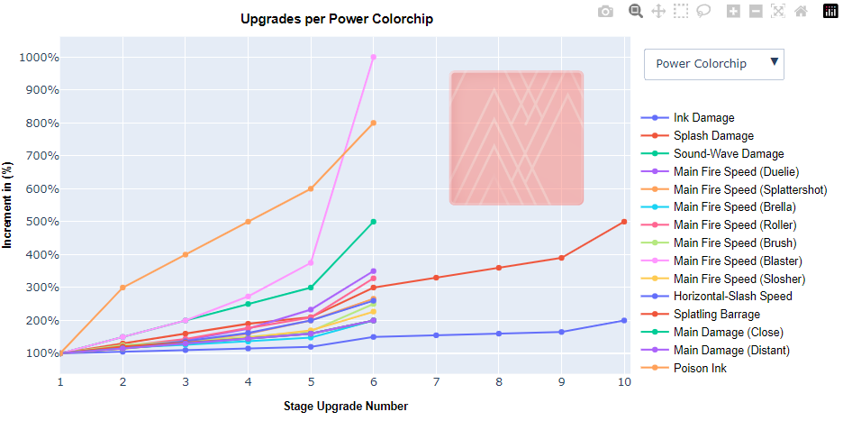
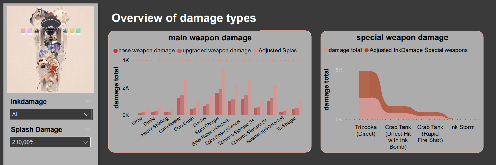

# Splatoon-3-Side-Order-analysis-Project

[](https://docs.python.org/3/)
[](https://learn.microsoft.com/en-us/dax/)
[](https://learn.microsoft.com/en-us/power-bi/)
[](https://docs.jupyter.org/en/latest/)
[]()

A project created in PowerBi and jupyter Notebook about the latest singleplayer dlc in Splatoon 3 called 'Side Order'. It goes over different statistics 
and upgrades the player can make or customize.

```bash
  git clone https://github.com/Xander172006/Splatoon-3-Side-Order-analysis-Project.git
```
<br />

## About this project

<center align="left">
   
    <div style="width: 250px" align="left">
        <p>
            Side Order is a singleplayer roadtype gamemode that is exclusive to splatoon 3 only. The mode focusses less about the story and more about the gameplay.
        </p>
        <p>
            In this project i wanted to create visualizations and interpertations of various aspects of this mode. Such as the colorchip system, permanent upgrades, unlockable rewards and stages with the
            added bonus of tracking the players own progression. I choose to do this analysis in PowerBI and Jupyter notebook, since it allows me to simplify abstract work from code with easy to understand explanation.
        </p>
    </div>
</center>

<br />

## Installation
### <ins>_Jupyter Notebook_<ins/>

Install the following packages to run jupyter notebook:

- [Pandas](https://pandas.pydata.org/docs/) to manipualte and interact with the data
- [Matplotlib ](https://matplotlib.org/stable/index.html) to customize and visualize the data in jupyter notebook
- [Plotly](https://plotly.com/python/) to create interactive plots in jupyter notebook
- [IPywidgets](https://ipywidgets.readthedocs.io/en/latest/) to create interactive widgets in jupyter notebook

However if you want to view the project using [**nbviewer**](https://nbviewer.jupyter.org/github/Xander172006/Side-Order-Project/blob/main/analysis/analysis.ipynb), there is a requirements.txt file already included in the project.

```bash
    python3 --version
    pip install -r requirements.txt
    pip install pandas matplotlib plotly ipywidgets
```

### <ins>_PowerBi_<ins/>

To view the dashboard created in PowerBI you need to install it from the official microsoft website [**PowerBI**](https://powerbi.microsoft.com/en-us/).
After installing PowerBI, you can use the `./data` folder to import the datasets into the dashboard.

*All the data is cleaned in advance, so you can directly use it without issues.

<br />

## Usage
### <ins>_Jupyter Notebook_<ins/>

Plotly and IPywidgets allows you to have interactive plots inside jupyter notebooks. It uses different elements to filter according to your needs.
If your not too familiar with Plotly's filter options, you can click here for a better [**Explanation**](https://plotly.com/python/filter/).
<br />

### **Colorchip linechart visualization**


<br />

### <ins>_PowerBi_<ins/>

PowerBi has many filter options you can use, that vary depending on the visualization of your choice.
To inspect things properly you can go to the main website of PowerBI for a better display.




## Contributors


[](Xander172006)

**Location:** Bit Academy, Amsterdam
</br>
**Email:** xanderpoggenklaas@gmail.com
</br>
**Twitter:** [@XPoggenklaas](https://twitter.com/XPoggenklaas)

<style>
    .centering_colorchips {
        display: flex;
        justify-content: center;
        gap: 15px;
        align-items: center;
    }

</style>


